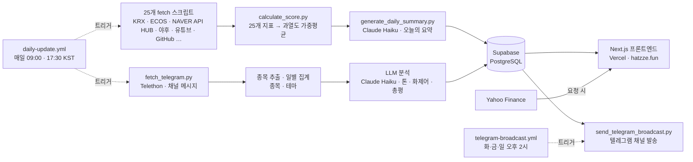

# hatzze | 데이터와 감성으로 읽는 시장

지금 시장이 어떤 상태인지를 세 화면으로 보여주는 대시보드입니다.

- **시장 브리핑** (`/`) — 시장·감성 지표 **25개**를 매일 종합한 하나의 **온도**(℃)
- **카더라 리포트** (`/kadera`) — 주식 텔레그램에서 무엇이 회자되는지
- **MDD 정밀분석** (`/mdd`) — 내 종목이 고점에서 얼마나 내려왔고, 과거엔 얼마 만에 돌아왔는지

🔗 **[hatzze.fun](https://hatzze.fun)**

> ⚠️ 햇쩨 지수의 저온·상온·고온·초고온 구간, 카더라 리포트의 집계, MDD 분석의 과거 통계는 모두 시장의 **과열 정도**·**회자되는 정도**·**지나간 기록**을 나타낸 표현일 뿐, **재미·참고용이며 매수·매도 신호가 아닙니다.**

---

## 시장 브리핑 · 햇쩨 지수 (`/`)

25개 지표의 과열도를 가중 평균해 `0~100`을 시장 온도 `℃`로 표시합니다.

| 구간 | 점수 | 의미 |
|---|---|---|
| ❄️ 저온 | `0–24` | 시장이 차분·위축 |
| 🌡️ 상온 | `25–49` | 평범 |
| 🔥 고온 | `50–74` | 달아오르는 중 |
| 🌋 초고온 | `75–100` | 과열 |

그 밖에:

- **오늘의 요약** — 매일 그날의 데이터를 **Claude Haiku**가 3문단으로 브리핑합니다. (① 기준선을 넘은 지표 수 + 현재 구간 ② 오늘 가장 뜨거운 지표와 그 의미 ③ 최근 며칠 추세) ②·③은 문단 수가 흔들리지 않도록 한 문장씩 따로 생성합니다.
- **지표 카드** — 25개 지표를 24장에 담습니다(명품·오마카세 소비는 한 장에 묶임). 카드마다 과열도·실제 값·30일 추이·인포그래픽.
- **상단 시세 티커** — 햇쩨 지수·나스닥 선물·코스피·코스닥·주요 종목·환율·비트코인 (10분 갱신).

---

## 카더라 리포트 (`/kadera`)

주식·재테크 **텔레그램 채널**의 공개 메시지를 매일 수집해, 지금 그 바닥에서 무엇이 회자되는지를 9개 카드로 정리합니다. 이름은 '카더라'(찌라시)에서 따왔습니다.

| 카드 | 보여주는 것 |
|---|---|
| 모니터링 현황 | 추적 중인 채널 규모 |
| 텔레그램 생태계 센티먼트 | 메시지 톤으로 본 시장 분위기 |
| 급부상 종목 | 평소보다 언급이 갑자기 뛴 종목 |
| 트렌딩 메시지 | 조회·공유로 가장 널리 퍼진 메시지 (오늘/7일/30일) |
| 테마 로테이션 | 관심이 어느 테마로 옮겨가는지 |
| 주요 종목 리포트 | 가장 많이 회자된 종목의 추이와 흐름 |
| 채널 파워 랭킹 | 조회율·확산력까지 반영한 채널 영향력 점수 |
| 뜨는 채널 | 최근 구독자가 많이 늘어난 채널 |
| 이슈 키워드 | 종목명이 아닌 화제어 |

수집은 **Telethon**(Telegram Client API), 종목 추출은 **KRX 상장 2,700여 종목 사전 + 별칭 매칭**, 메시지 톤·화제어 분류와 총평 작성은 **Claude Haiku**가 맡습니다. 모니터링 채널 목록은 레포에 두지 않고 Supabase에서 런타임 조회합니다.

집계에서 지키는 두 가지:

- **절대량이 아니라 점유율(share)로 비교합니다.** 주말엔 전체 메시지가 평일의 1/10로 떨어져, 절대 언급 수로 증감을 재면 모든 항목이 일제히 ▼로 나옵니다.
- **하루치끼리 비교하지 않습니다.** 최근 3일 평균 vs 그 이전 평균으로 봐야 메시지가 얇은 날의 요동이 가라앉습니다.

---

## MDD 정밀분석 (`/mdd`)

종목 하나를 골라 **고점 대비 낙폭(MDD)** 을 뜯어봅니다. "지금 −32%"라는 숫자 하나만으로는 이게 흔한 일인지 드문 일인지 알 수 없어서, 같은 종목의 과거 기록을 옆에 놓고 봅니다. 기간은 1·3·5·10년·전체로 바꿀 수 있습니다.

| 카드 | 보여주는 것 |
|---|---|
| 헤드라인 | 지금 낙폭 + 고점 이후 수중(underwater) 차트 |
| 리스크 프로필 | 이 종목을 들고 있으면 감수하는 위험 (낙폭 대비 보상 · 하락 vs 회복 속도 · 혼자 빠지나 같이 빠지나) |
| 이 하락, 시장 탓일까 종목 탓일까 | 고점 이후 같은 기간의 시장·테마와 나란히 비교 |
| 이 하락의 성격 | 급락형/완만형 구분과, 과거 각 유형의 회복 기간 |
| 회복까지 걸린 시간 | 과거 이만큼 빠졌을 때 고점을 되찾기까지 걸린 기간의 분포 |
| 역대 낙폭 Top 5 | 이 기간 가장 깊었던 하락과 회복 기간 |
| 테마 비교 | 같은 테마 대표 종목들의 지금 낙폭 |

시세는 **야후 파이낸스 일봉**을 호출 시점에 직접 받아 계산합니다 — 별도 크론이나 테이블 없이, 상단 티커와 같은 방식으로 CDN에 15분 캐시합니다. 종가는 액면분할·감자를 소급 조정한 값이라 장기 낙폭이 왜곡되지 않습니다(`adjclose`는 감자에서 음수가 나와 쓰지 않습니다).

검색창은 코스피 전 종목을 싣고, 카더라 리포트의 **급부상 종목**·**주요 종목**을 추천으로 띄웁니다. 카더라 카드에서 종목을 누르면 그 종목의 MDD로 바로 넘어옵니다(`/mdd?code=005930&market=KOSPI`).

---

## 아키텍처



**파이프라인이 계산하고, 프론트는 읽기만 합니다.** 지표 수집·점수 계산·요약 생성과 텔레그램 수집·분석은 GitHub Actions가 하루 2회(오전 주 실행 + 오후 실패 만회) 돌려 Supabase에 저장하고, Next.js는 매 요청마다 Supabase에서 최신 값을 읽어 렌더합니다.

예외는 **상단 시세 티커**(`/api/ticker`)와 **MDD 정밀분석**(`/api/mdd`) 둘뿐입니다. 둘 다 배치가 아니라 요청 시점에 야후·업비트를 직접 호출하고 CDN에 짧게 캐시합니다 — 하루 한 번 갱신하는 배치에 얹기엔 성격이 다릅니다.

서버 함수는 `vercel.json`의 `regions: ["icn1"]`로 **서울에 고정**돼 있습니다 — 지우지 마세요. Supabase가 `ap-northeast-2`(서울)라 기본값인 `iad1`(미국)을 쓰면 렌더 중 쿼리마다 태평양을 왕복해 페이지가 몇 초씩 느려집니다.

---

## 폴더 구조

```
hatzze/
├─ app/                     # Next.js(App Router) 프론트엔드
│  ├─ page.tsx              #   시장 브리핑(히어로 지수 + 지표 카드)
│  ├─ kadera/               #   카더라 리포트(텔레그램 분석)
│  ├─ mdd/                  #   MDD 정밀분석(종목 낙폭·회복 통계)
│  ├─ privacy/              #   개인정보처리방침
│  ├─ AppShell.tsx          #   상단 티커·네비·다크모드 셸
│  └─ api/                  #   ticker(실시간 시세) · mdd(낙폭 계산)
├─ lib/                     # Supabase 조회·야후 시세·MDD 계산·포맷 유틸
├─ data-pipeline/           # Python 배치 파이프라인
│  ├─ scripts/              #   지표별 fetch_*.py · calculate_*.py · generate_*.py · 텔레그램 수집·분석·발송
│  ├─ config/               #   지표 임계값·가중치 · 종목 별칭 · 테마 사전
│  ├─ backtest/             #   지표 눈금·가중치 재보정용 백테스트 하네스
│  └─ common/               #   Supabase 클라이언트·야후 클라이언트·공용 유틸
├─ supabase/                # 스키마 + 마이그레이션 SQL(migration_001~023)
├─ docs/                    # 지표 감사 기록(2026-07-23 재보정 근거)
└─ .github/workflows/       # daily-update.yml (일일 배치) · telegram-broadcast.yml (오후 발송)
```

---

## 지표 (25개)

가중치와 임계값은 **코드가 소스 오브 트루스**입니다(`data-pipeline/config/indicator_weights.py`·`indicator_thresholds.py`). 예전엔 Supabase `indicators.weight`에서만 읽어 버전 관리가 안 됐습니다.

지표별 무게는 균등하지 않습니다. 1년치 실데이터(고점 3회·저점 3회)로 지표마다 **고점창 평균 − 저점창 평균 스프레드**를 재서 배정했고, 그 근거는 [`docs/indicator-audit-2026-07-23.md`](docs/indicator-audit-2026-07-23.md)에 있습니다. 현재 가중치 합은 46.5이며, 가장 무거운 축은 거래대금 급증도(4.5)·신고가 괴리율(4.0)·초보 검색량(3.5)입니다.

<details>
<summary><b>시장 지표 (14개)</b> — 가격·수급·변동성 등 시장 데이터</summary>

- 코스피 신고가 대비 괴리율
- 코스피 상승 속도 (60일)
- 버핏지수 (시가총액 / GDP)
- 거래대금 급증도
- VKOSPI (변동성지수)
- 금 대비 코스피 상대강도
- 원/달러 환율 변동성
- 레버리지 ETF·선물 미결제약정 종합 지수
- 아시아 3국(일본·홍콩·대만) 대비 코스피 상대강도
- 최근 한 달 매매 안전장치 동향 (사이드카·서킷브레이커)
- 개인 순매수 강도
- 옵션 풋/콜 비율
- 투자자예탁금
- 거래대금 쏠림도 (상위10 종목 비중)

</details>

<details>
<summary><b>감성 지표 (11개)</b> — 검색·커뮤니티·소비 등 대중 심리</summary>

- 주식 초보 검색량 지수
- 디씨 주식 갤러리 감성 지수
- 경제뉴스 헤드라인 감성 지수
- 경제 베스트셀러 비중 (베스트셀러 100권 중 경제 도서)
- 재테크 유튜브 조회수
- 명품·수입차 소비 검색 지수
- 오마카세·파인다이닝 웨이팅 검색 지수
- 실물–증시 괴리 지수
- 업비트 투기 과열 지수
- 깃헙 거래봇 생성 수
- 증권 앱 인기차트 순위

</details>

---

## 기술 스택

| | |
|---|---|
| **프론트엔드** | Next.js 16 (App Router) · React 19 · TypeScript · Tailwind CSS 4 · Pretendard · Bricolage Grotesque |
| **데이터 파이프라인** | Python 3.11 · Supabase Python SDK · Anthropic SDK (Claude Haiku) · Telethon |
| **데이터베이스** | Supabase (PostgreSQL, RLS) |
| **자동화·배포** | GitHub Actions (일일 배치) · Vercel (프론트, `icn1`) |
| **계측·기타** | Google Analytics 4 (`@next/third-parties`) · logo.dev (종목 로고) |

---

## 로컬 개발

### 프론트엔드

```bash
npm install
npm run dev          # http://localhost:3000
```

한 워킹트리에서 dev 서버를 둘 이상 띄우면 `.next`를 서로 덮어써 화면이 깨집니다. 두 번째는 별도 빌드 디렉터리를 쓰는 `npm run dev:alt`로 띄우세요(`npm run build:local` / `start:local`도 같은 이유로 있습니다).

### 데이터 파이프라인

```bash
cd data-pipeline
python -m venv .venv && source .venv/bin/activate
pip install -r requirements.txt

python scripts/calculate_score.py          # 지표 종합 점수 계산
python scripts/generate_daily_summary.py   # 오늘의 요약 생성

python scripts/fetch_telegram.py           # 카더라: 채널 메시지 수집
python scripts/extract_telegram_stocks.py  # 카더라: 메시지에서 종목 추출
```

텔레그램 스크립트는 세션이 먼저 필요합니다. `my.telegram.org`에서 `api_id`/`api_hash`를 발급받고 `python scripts/generate_telegram_session.py`로 한 번 로그인해 세션 문자열을 얻으세요. **세션은 계정 로그인 권한이라 절대 커밋하면 안 됩니다.**

---

## 환경변수

`.env.example`을 복사해 `.env.local`에 키를 채웁니다.

```bash
cp .env.example .env.local
```

| 변수 | 용도 |
|---|---|
| `SUPABASE_URL` / `SUPABASE_PUBLISHABLE_KEY` | 프론트엔드 읽기용 |
| `SUPABASE_SECRET_KEY` | 파이프라인 쓰기용 + 카더라 리포트 조회용 |
| `KRX_API_KEY` | 코스피 시세·신고가·시총·VKOSPI 등 |
| `ECOS_API_KEY` | 한국은행 GDP (버핏지수) |
| `FRED_API_KEY` | 미 연준 FRED — 거시·금리 (도입 예정, 아직 쓰는 지표 없음) |
| `NAVER_HUB_KEY_ID` / `NAVER_HUB_KEY` | NAVER API HUB — 검색어트렌드 · 뉴스 검색 |
| `YOUTUBE_API_KEY` | 유튜브 재테크 콘텐츠 |
| `ALADIN_TTB_KEY` | 알라딘 베스트셀러 |
| `ANTHROPIC_API_KEY` | 오늘의 요약 · 카더라 리포트 LLM 분석(Claude Haiku) |
| `GITHUB_TOKEN` | 깃헙 검색 API (선택 — 없으면 비인증) |
| `TELEGRAM_API_ID` / `TELEGRAM_API_HASH` / `TELEGRAM_SESSION` | 카더라 리포트 메시지 수집 |
| `TELEGRAM_CHANNELS_SHEET_ID` | 모니터링 채널 목록 시트 |
| `TELEGRAM_BOT_TOKEN` / `TELEGRAM_BROADCAST_CHAT_ID` | 채널에 오늘의 지수 발송 (수집용 값과 별개인 봇 토큰) |
| `NEXT_PUBLIC_GA_ID` | Google Analytics 4 측정 ID (선택 — 없으면 gtag를 아예 안 넣음) |
| `NEXT_PUBLIC_LOGO_DEV_KEY` | logo.dev 종목 로고 (선택 — 없으면 이름 첫 글자 배지) |
| `GOOGLE_SITE_VERIFICATION` / `NAVER_SITE_VERIFICATION` | 검색엔진 소유확인 메타 태그 (선택) |

`NEXT_PUBLIC_` 접두어가 붙은 둘은 클라이언트에 그대로 노출되는 공개값입니다. GA ID를 로컬에 채워두면 개발 중 방문이 프로덕션 통계에 잡히니 검증할 때만 켜세요.

---

## 자동화 (GitHub Actions)

`.github/workflows/daily-update.yml`이 매일 두 번 파이프라인을 실행합니다.

| cron 발화 | 실제 실행 | 화면 표기 | 역할 |
|---|---|---|---|
| 09:00 KST | ~10:45 | 오전 11시 | 주 실행 |
| 17:30 KST | ~19:50 | 오후 7시 | 아침 실패 만회 + 그날 종가 수집 |

**발화 시각 ≠ 실제 실행 시각입니다.** GitHub 예약 큐가 실측 90~150분 밀리는데, 이 지연을 역이용해 실제 실행이 원하는 시각에 떨어지도록 발화를 앞에 잡았습니다. 두 시각 모두 앞당기면 안 됩니다.

- **아침**은 KRX Open API가 전날 자료를 그날 오전에야 올려서, 10:30 이전에 실행되면 그제 자료를 받습니다.
- **오후**는 지수 종가를 야후에서 받게 되면서 하한이 생겼습니다(**16:00 KST보다 앞당기지 말 것**). 아침 실행은 정규장 한복판이라 장중값을 일부러 버리므로, 그날 종가를 담는 실행은 오후 하나뿐입니다.

지표 수집·점수 계산에 이어 카더라 리포트 파이프라인(채널 동기화 → 메시지 수집 → 커버리지 검사 → 영향력 점수 → 종목 추출 → 종목·테마 집계 → LLM 분류 → 총평 생성)이 같은 워크플로우에서 돕니다.

각 스텝은 `continue-on-error`로 개별 실패가 전체를 막지 않으며, 실패가 있으면 알림 이슈를 열어 추적합니다. **조용한 고장**을 막는 감시도 둘 걸어 뒀습니다.

- `check_freshness.py` — 지표가 갱신을 멈췄는데 화면은 옛 값을 태연히 보여주는 경우를 잡습니다.
- `check_telegram_coverage.py` — 채널 일부만 수집된 상태로 굳는 경우를 잡습니다. 하루치 비율이 아니라 **연속 일수**로 판정합니다. 하루만 보면 캐시가 차는 중인 정상적인 날까지 잡혀서입니다.

### 텔레그램 채널 발송

[채널](https://t.me/hatzze69)에 그날의 글을 올립니다. A·B 는 같은 워크플로 끝에 붙고, 오후 2시에 나가는 C·D 는 발송만 하는 별도 워크플로(`telegram-broadcast.yml`)가 맡습니다. 네 가지가 소재로 갈립니다 (아침=주제·사건 · 저녁=종목 · 테마=관심 이동 · 주간=생태계).

| | 언제 | 내용 |
|---|---|---|
| A 어제 브리핑 | 월~금 · 오전 파이프라인 완료 후 5분 | 어제 이슈 키워드 + 밤사이 오간 이야기 |
| B 마감 리포트 | 월~금 · 오후 파이프라인 완료 후 5분 | 오늘의 온도 + 카더라 급부상 종목 3 |
| C 관심 이동 | 화·금 · 오후 2시 | 테마 순위 변동 + 무엇이 달라졌나 |
| D 주간 결산 | 일요일 · 오후 2시 | 주간 최다 언급 종목 + 테마 |

발송은 **자료가 신선할 때만** 나갑니다(`check_freshness`·`calculate_score` 성공 + 재실행 제외). 구독자 전원에게 틀린 숫자를 쏘는 건 화면에 틀린 숫자가 떠 있는 것보다 회수가 어렵기 때문입니다. 미리보기는 `python scripts/send_telegram_broadcast.py --format <이름>`으로 볼 수 있고, **아무 인자 없이 돌리면 발송하지 않습니다.**

---

## Supabase 스키마

`supabase/schema.sql`을 Supabase SQL Editor에 붙여넣어 실행하면 `indicators`, `indicator_values`, `daily_score` 3개 테이블과 RLS(공개 읽기 전용·쓰기는 service_role)가 설정됩니다. 이후 스키마 변경은 `supabase/migration_*.sql` 파일로 관리합니다(현재 023까지).

여기에 KRX 상장종목 마스터 `stocks`(MDD 검색창·종목 추출이 함께 씁니다)와 카더라 리포트용 `telegram_*` 테이블이 마이그레이션으로 붙습니다. `telegram_*`는 공개 읽기를 열지 않아서, 프론트도 `SUPABASE_SECRET_KEY`로 조회합니다.

조회할 때 주의: **PostgREST는 응답을 1000행에서 자릅니다.** 표가 그보다 커지면 페이징해야 하고, `.in()` 목록이 길 때는 또 다른 한계에 걸립니다. 잘린 결과는 에러가 아니라 폴백에 가려 '표시 이상'으로 위장하니, 개수를 세어 확인하세요.

---

## 데이터 출처

KRX 정보데이터시스템 · 한국은행 ECOS · 미 연준 FRED · NAVER API HUB(검색어트렌드·뉴스) · 네이버 금융 · YouTube Data API · 알라딘 · GitHub Search API · Apple App Store · DCInside · Upbit · Yahoo Finance · Telegram(공개 채널)

**지수 종가만 야후, 나머지는 KRX입니다.** KRX Open API는 지수도 T+1이라 그날 종가를 주지 못해 종가 경로만 야후로 옮겼습니다(2026-07-29). 거래대금·VKOSPI·풋콜·시가총액·선물 미결제약정·전종목 거래대금은 야후에 없어 여전히 KRX이고 여전히 T+1입니다.

증권사 오픈 API는 시세 출처로 쓸 수 없습니다 — 약관이 개인 본인 매매 목적으로 한정하고 제3자 배포·상업적 활용을 금지합니다.
