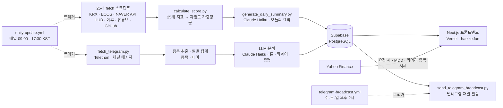

# hatzze | 데이터와 감성으로 읽는 시장

**v1.0.0 베타** · 🔗 **[hatzze.fun](https://hatzze.fun)**

지금 시장이 어떤 상태인지를 세 화면으로 보여주는 대시보드입니다.

- **시장 브리핑** (`/`) — 시장·감성 지표 **25개**를 매일 종합한 하나의 **온도**(℃)
- **카더라 리포트** (`/kadera`) — 주식 텔레그램에서 무엇이 회자되는지
- **MDD 정밀분석** (`/mdd`) — 내 종목이 고점에서 얼마나 내려왔고, 과거엔 얼마 만에 돌아왔는지

네 번째 화면 **서학개미 해부도**는 준비 중입니다. 사이드바에 예고 항목으로만 걸어 두고, 링크가 아니라 누를 수 없는 자리로 뒀습니다.

**2026-08-06 베타 오픈.** 서비스 전체가 베타라 로고 옆에 배지를 답니다. 지표는 계속 늘고 눈금도 다시 잡히는 중이라, 시장 브리핑 맨 아래에 새 지표를 제보받는 자리를 뒀습니다.

> ⚠️ 햇쩨 지수의 저온·상온·고온·초고온 구간, 카더라 리포트의 집계, MDD 분석의 과거 통계는 모두 시장의 **과열 정도**·**회자되는 정도**·**지나간 기록**을 나타낸 표현일 뿐, **재미·참고용이며 매수·매도 신호가 아닙니다.**

[이용약관](https://hatzze.fun/terms) · [개인정보처리방침](https://hatzze.fun/privacy) (2026-08-06 시행)

---

## 시장 브리핑 · 햇쩨 지수 (`/`)

25개 지표의 과열도를 가중 평균해 `0~100`을 시장 온도 `℃`로 표시합니다.

| 구간 | 점수 | 의미 |
|---|---|---|
| ❄️ 저온 | `0–24` | 시장이 차분·위축 |
| 🌡️ 상온 | `25–49` | 평범 |
| 🔥 고온 | `50–74` | 달아오르는 중 |
| 🌋 초고온 | `75–100` | 과열 |

화면은 **히어로 한 판 + 지표 시트**로 나뉩니다.

- **히어로** — 셀 셋. ① 오늘의 온도와 앞 날짜 대비 등락 ② **지표 분포**(25개가 네 구간에 몇 개씩 앉아 있는지, 구간을 누르면 그 지표로 내려갑니다) ③ **오늘의 브리핑** 3문단(초고온 지표 수와 현재 구간 → 오늘 가장 뜨거운 지표 → 최근 며칠 추세. 뒤 두 문단을 **Claude Haiku**가 씁니다).
- **지표 시트** — 25개 지표를 24장에 담아 한 판에 올립니다(명품·오마카세 소비는 한 장에 묶임). 카드마다 과열도·실제 값·30일 추이·인포그래픽.
- **상단 티커** — 햇쩨 지수와 **카더라 집계**(급부상 종목·주목도 1위·생태계 센티먼트·이슈 키워드).

LLM이 쓴 문장은 저장되기 전에 검수 레이어(`common/text_check.py`)를 지납니다. 깨진 글자·비문과 없는 낱말을 걸러내며, 오늘의 요약·종목 내러티브·텔레그램 발송 글이 같은 그물을 씁니다. AI가 쓴 글에는 ✨ 표시가 붙습니다.

---

## 카더라 리포트 (`/kadera`)

주식·재테크 **텔레그램 채널**의 공개 메시지를 매일 수집해, 지금 그 바닥에서 무엇이 회자되는지를 정리합니다. 이름은 '카더라'(찌라시)에서 따왔습니다.

히어로 세 칸이 그날의 요지를 먼저 말하고, 그 아래로 묶음 셋이 이어집니다.

| | 카드 | 보여주는 것 |
|---|---|---|
| **히어로** | 모니터링 현황 | 추적 중인 채널 규모 |
| | 생태계 센티먼트 | 메시지 톤으로 본 시장 분위기 |
| | **오늘의 요약** | 그날 오간 이야기를 **Claude Haiku**가 세 대목으로 (전체 분위기 · 테마 지형 · 지금 오가는 이야기) |
| **최근 뜨는 것** | 급부상 종목 | 평소보다 언급이 갑자기 뛴 종목 |
| | 테마 로테이션 | 관심이 어느 테마로 옮겨가는지 |
| | 이슈 키워드 | 종목명이 아닌 화제어 |
| **무슨 얘기가 오갔나** | 주요 종목 리포트 | 가장 많이 회자된 종목의 추이와 흐름 |
| | 트렌딩 메시지 | 조회·공유로 가장 널리 퍼진 메시지 (오늘/7일/30일) |
| **채널** | 채널 파워 랭킹 | 조회율·확산력까지 반영한 채널 영향력 점수 (▲▼는 **3일 전 순위** 대비) |
| | 뜨는 채널 | 최근 구독자가 많이 늘어난 채널 |

수집은 **Telethon**(Telegram Client API), 종목 추출은 **KRX 상장 2,700여 종목 사전 + 별칭 매칭**, 메시지 톤·화제어 분류와 총평 작성은 **Claude Haiku**가 맡습니다. 모니터링 채널 목록은 레포에 두지 않고 Supabase에서 런타임 조회합니다.

집계에서 지키는 것:

- **절대량이 아니라 점유율(share)로 비교합니다.** 주말엔 전체 메시지가 평일의 1/10로 떨어져, 절대 언급 수로 증감을 재면 모든 항목이 일제히 ▼로 나옵니다.
- **하루치끼리 비교하지 않습니다.** 최근 3일 평균 vs 5일 이상 이전 평균으로 봐야 메시지가 얇은 날의 요동이 가라앉습니다. 사이트와 텔레그램 발송 글이 같은 창을 씁니다.
- **"N개 채널"은 창 전체의 서로 다른 채널 수입니다.** 어느 화면에서 보든 같은 규칙으로 셉니다.
- **유령 언급을 셈에서 뺍니다.** 종목명이 일반 단어나 다른 고유명사에 얹히면 없는 언급이 잡힙니다. 회사명이 더 긴 낱말의 앞머리인 경우, 지주사 이름이 계열사 이름에 얹히는 경우, 증권사 이름이 리포트 발행처로 적힌 경우, 이름 앞에 수식어가 붙어 합성어가 된 경우, 조사처럼 보이는 글자가 사실은 다른 회사 이름의 일부인 경우(하이브 ← 하이브**로**자임)를 각각 걸러냅니다.
- **줄임말은 제자리를 찾아 줍니다.** 계열사·브랜드 줄임말은 유령이 아니라 진짜 언급이라, 걸러내는 대신 별칭 사전으로 원 종목에 붙입니다.

---

## MDD 정밀분석 (`/mdd`)

종목 하나를 골라 **고점 대비 낙폭(MDD)** 을 뜯어봅니다. "지금 −32%"라는 숫자 하나만으로는 이게 흔한 일인지 드문 일인지 알 수 없어서, 같은 종목의 과거 기록을 옆에 놓고 봅니다. 기간은 1·3·5·10년·전체로 바꿀 수 있습니다.

| | 카드 | 보여주는 것 |
|---|---|---|
| **히어로** | 헤드라인 · 언더워터 차트 | 지금 낙폭과 고점 이후의 수중 구간 (눌러서 확대) |
| | 리스크 프로필 | 이 종목을 들고 있으면 감수하는 위험 (낙폭 대비 보상 · 하락 vs 회복 속도 · 혼자 빠지나 같이 빠지나) |
| **과거 낙폭 사례** | 역대 낙폭 Top 5 | 이 기간 가장 깊었던 하락과 회복 기간 |
| | 회복까지 걸린 기간 | 과거 이만큼 빠졌을 때 고점을 되찾기까지 걸린 기간의 분포 |
| **이 하락의 정체** | 시장 탓일까, 종목 탓일까 | 고점 이후 같은 기간의 지수·업종과 나란히 비교 |
| | 이 하락의 성격 | 급락형/완만형 구분과, 과거 각 유형의 회복 기간 |
| | 테마 비교 | 같은 테마 대표 종목들의 지금 낙폭 |

시세는 **야후 파이낸스 일봉**을 호출 시점에 직접 받아 계산합니다. 액면분할·감자를 소급 조정한 종가라 장기 낙폭이 왜곡되지 않습니다.

검색창은 코스피 전 종목을 싣고, 카더라 리포트의 **급부상 종목**·**주요 종목**을 추천으로 띄웁니다. 카더라 카드에서 종목을 누르면 그 종목의 MDD로 바로 넘어옵니다(`/mdd?code=005930&market=KOSPI`).

---

## 아키텍처



**파이프라인이 계산하고, 프론트는 읽기만 합니다.** 지표 수집·점수 계산·요약 생성과 텔레그램 수집·분석은 GitHub Actions가 하루 2회(오전 주 실행 + 오후 실패 만회) 돌려 Supabase에 저장하고, Next.js는 매 요청마다 Supabase에서 최신 값을 읽어 렌더합니다.

요청 시점에 바깥을 부르는 자리는 둘입니다. **MDD 정밀분석**이 야후 일봉을 받아 그 자리에서 계산하고, **카더라 종목 카드**가 야후 현재가를 10분 캐시로 붙입니다. 상단 티커(`/api/ticker`)는 Supabase에 쌓인 카더라 집계만 읽습니다.

**화면 전환은 클릭 즉시 시작됩니다.** 무거운 두 화면(카더라·MDD)에 자리표시자를 두고, 링크에 커서·손가락·포커스가 닿는 순간 프리페치를 겁니다.

**세 화면이 같은 시각 언어를 씁니다.** 카드를 낱장으로 흩지 않고 한 판의 시트에 담고, 온도는 50을 경계로 파랑(차가움)↔빨강(뜨거움) 두 색으로만 말합니다. 색·간격·모서리는 전역 토큰(`app/globals.css`·`app/ui.tsx`) 한 벌에서 나오므로 한 페이지만 갈라지지 않습니다.

**밝은 화면·어두운 화면을 모두 지원합니다.** 선택은 쿠키(`hz-theme`)에 남고 서버가 첫 렌더부터 그 테마로 그려서, 새로고침할 때 흰 화면이 번쩍하지 않습니다. 기본값은 밝은 화면입니다.

**모바일(≤560px)은 구성이 다릅니다.** 사이드바가 숨고 내비게이션이 탑바 오른쪽 햄버거로 올라가며, 좁은 화면에서 읽히지 않는 흐르는 티커는 걷어냅니다. 툴팁은 호버가 없으니 탭으로 열립니다. 첫 방문에는 화면 아래에 PC를 권하는 안내가 한 번 뜹니다.

---

## 폴더 구조

```
hatzze/
├─ app/                     # Next.js(App Router) 프론트엔드
│  ├─ page.tsx              #   시장 브리핑(히어로 + 지표 시트)
│  ├─ kadera/               #   카더라 리포트(텔레그램 분석)
│  ├─ mdd/                  #   MDD 정밀분석(종목 낙폭·회복 통계)
│  ├─ terms/                #   이용약관
│  ├─ privacy/              #   개인정보처리방침
│  ├─ legal.tsx             #   법정 고지 두 문서가 공유하는 조판
│  ├─ ui.tsx · globals.css  #   색·타이포·간격 토큰(라이트/다크 한 벌)
│  ├─ AppShell.tsx          #   상단 티커 · 네비(데스크톱 사이드바 / 모바일 햄버거) · 테마 셸
│  └─ api/                  #   ticker(카더라 집계) · mdd(낙폭 계산) · channel-photo(채널 아바타)
├─ lib/                     # Supabase 조회·야후 시세·MDD 계산·테마 사전·포맷 유틸
├─ data-pipeline/           # Python 배치 파이프라인
│  ├─ scripts/              #   지표별 fetch_*.py · calculate_*.py · generate_*.py · 텔레그램 수집·분석·발송
│  ├─ config/               #   지표 임계값·가중치 · 종목 별칭·오탐 위험군 · 테마 사전
│  ├─ backtest/             #   지표 눈금·가중치 재보정용 백테스트 하네스
│  └─ common/               #   Supabase·야후 클라이언트 · 발송 문안 · LLM 문장 검수 · 공용 유틸
├─ supabase/                # 스키마 + 마이그레이션 SQL(migration_001~025)
├─ docs/                    # 지표 감사 기록
├─ githooks/                # 커밋 훅(`git config core.hooksPath githooks`)
└─ .github/workflows/       # daily-update.yml (일일 배치) · telegram-broadcast.yml (오후 발송)
```

---

## 지표 (25개)

가중치와 임계값은 **코드가 소스 오브 트루스**입니다(`data-pipeline/config/indicator_weights.py`·`indicator_thresholds.py`).

지표별 무게는 균등하지 않습니다. 실데이터의 고점·저점 구간에서 지표마다 **고점창 평균 − 저점창 평균 스프레드**를 재서 배정하고, 지표가 바뀌면 25개를 전부 다시 잽니다(최근 재보정 2026-08-01). 현재 가중치 합은 43.0이며, 가장 무거운 축은 거래대금 급증도(4.5)·신고가 괴리율(4.0)·초보 검색량(4.0)·코스피 상승 속도(3.0)입니다. 방법론과 근거는 [`docs/indicator-audit-2026-07-23.md`](docs/indicator-audit-2026-07-23.md)와 `data-pipeline/backtest/`에 있습니다.

가중치와 별개로 지표별 **눈금**(원값을 0~100 과열도로 옮기는 임계값)도 표본 분포가 바뀌면 다시 잡습니다. 눈금이 바뀌면 같은 시장 상황에서도 점수가 달라지므로, 손댈 때마다 백테스트 하네스로 과거 구간을 통째로 다시 돌려 봅니다.

<details>
<summary><b>시장 지표 (14개)</b> — 가격·수급·변동성 등 시장 데이터</summary>

- 코스피 신고가 대비 괴리율
- 코스피 상승 속도 (60일)
- 버핏지수 (시가총액 / GDP)
- 거래대금 급증도
- VKOSPI (변동성지수)
- 금 대비 코스피 상대강도
- 원/달러 환율 변동성
- 레버리지·선물 약정 종합 지수
- 아시아 3국 대비 코스피 (일본·홍콩·대만)
- 최근 한 달 매매 안전장치 동향 (사이드카·서킷브레이커)
- 고점권 외국인 매도 (지수가 52주 고점 −8% 이내일 때의 순매도)
- 옵션 풋/콜 비율
- 급등 종목 비율 (종가가 +10% 이상 오른 종목 ÷ 전체)
- 거래대금 쏠림도 (상위10 종목 비중)

</details>

<details>
<summary><b>감성 지표 (11개)</b> — 검색·커뮤니티·소비 등 대중 심리</summary>

- 주식 초보 검색량 지수
- 디씨 주갤 감성 지수
- 경제뉴스 감성 지수
- 경제 베스트셀러 비중 (베스트셀러 100권 중 경제 도서)
- 재테크 유튜브 조회수
- 명품·수입차 소비 검색 지수
- 오마카세·파인다이닝 웨이팅 검색 지수
- 실물–증시 괴리 지수
- 코인 투자 과열 지수
- 깃헙 거래봇 생성 수
- 증권 앱 인기차트 순위

</details>

---

## 기술 스택

| | |
|---|---|
| **프론트엔드** | Next.js 16 (App Router) · React 19 · TypeScript · Tailwind CSS 4 · Pretendard · Bricolage Grotesque |
| **데이터 파이프라인** | Python 3.11 · Supabase Python SDK · Anthropic SDK (Claude Haiku) · Telethon |
| **데이터베이스** | Supabase (PostgreSQL, RLS) |
| **자동화·배포** | GitHub Actions (일일 배치) · Vercel (프론트, 서울 리전 `icn1`) |
| **계측·기타** | Google Analytics 4 (`@next/third-parties`) · logo.dev (종목 로고) |

---

## 로컬 개발

### 프론트엔드

```bash
npm install
git config core.hooksPath githooks   # 클론마다 한 번
npm run dev          # http://localhost:3000
```

한 워킹트리에서 dev 서버를 둘 이상 띄울 땐 두 번째를 `npm run dev:alt`로 띄웁니다(`.next`를 서로 덮어씁니다). 프리페치와 화면 전환 속도는 프로덕션 빌드에서만 확인할 수 있어 `npm run build:local` + `npm run start:local`을 씁니다.

### 데이터 파이프라인

```bash
cd data-pipeline
python -m venv .venv && source .venv/bin/activate
pip install -r requirements.txt

python scripts/calculate_score.py          # 지표 종합 점수 계산
python scripts/generate_daily_summary.py   # 오늘의 요약 생성

python scripts/fetch_telegram.py           # 카더라: 채널 메시지 수집
python scripts/extract_telegram_stocks.py  # 카더라: 메시지에서 종목 추출
```

텔레그램 스크립트는 세션이 먼저 필요합니다. `my.telegram.org`에서 `api_id`/`api_hash`를 발급받고 `python scripts/generate_telegram_session.py`로 한 번 로그인해 세션 문자열을 얻으세요. **세션은 계정 로그인 권한이라 절대 커밋하면 안 됩니다.**

---

## 환경변수

`.env.example`을 복사해 `.env.local`에 키를 채웁니다.

```bash
cp .env.example .env.local
```

| 변수 | 용도 |
|---|---|
| `SUPABASE_URL` / `SUPABASE_PUBLISHABLE_KEY` | 프론트엔드 읽기용 |
| `SUPABASE_SECRET_KEY` | 파이프라인 쓰기용 + 카더라 리포트 조회용 |
| `KRX_API_KEY` | 코스피 시세·신고가·시총·VKOSPI·급등 종목 등 |
| `ECOS_API_KEY` | 한국은행 — GDP(버핏지수) · 외국인 순매수 일별(고점권 외국인 매도) |
| `FRED_API_KEY` / `KMA_API_KEY` | 미 연준 FRED(거시·금리) · 기상청 ASOS 일자료 (둘 다 도입 예정, 아직 쓰는 지표 없음) |
| `NAVER_HUB_KEY_ID` / `NAVER_HUB_KEY` | NAVER API HUB — 검색어트렌드 · 뉴스 검색 |
| `YOUTUBE_API_KEY` | 유튜브 재테크 콘텐츠 |
| `ALADIN_TTB_KEY` | 알라딘 베스트셀러 |
| `ANTHROPIC_API_KEY` | 오늘의 요약 · 카더라 리포트 LLM 분석(Claude Haiku) |
| `GITHUB_TOKEN` | 깃헙 검색 API (선택 — 없으면 비인증) |
| `TELEGRAM_API_ID` / `TELEGRAM_API_HASH` / `TELEGRAM_SESSION` | 카더라 리포트 메시지 수집 |
| `TELEGRAM_CHANNELS_SHEET_ID` | 모니터링 채널 목록 시트 |
| `TELEGRAM_BOT_TOKEN` / `TELEGRAM_BROADCAST_CHAT_ID` | 채널에 오늘의 지수 발송 (수집용 값과 별개인 봇 토큰) |
| `NEXT_PUBLIC_GA_ID` | Google Analytics 4 측정 ID (선택 — 없으면 gtag를 아예 안 넣음) |
| `NEXT_PUBLIC_LOGO_DEV_KEY` | logo.dev 종목 로고 (선택 — 없으면 이름 첫 글자 배지) |
| `GOOGLE_SITE_VERIFICATION` / `NAVER_SITE_VERIFICATION` | 검색엔진 소유확인 메타 태그 (선택) |

`NEXT_PUBLIC_` 접두어가 붙은 둘은 클라이언트에 그대로 노출되는 공개값입니다.

---

## 자동화 (GitHub Actions)

`.github/workflows/daily-update.yml`이 매일 두 번 파이프라인을 실행합니다.

| cron 발화 | 실제 실행 | 완료 | 화면 표기 | 역할 |
|---|---|---|---|---|
| 06:30 KST | ~07:30 | ~08:40 | 오전 9시 | 주 실행 |
| 17:30 KST | ~18:40 | ~20:10 | 오후 8시 | 아침 실패 만회 + 그날 종가 수집 |

**발화 시각 ≠ 실제 실행 시각입니다.** GitHub 예약 큐가 실행을 밀어냅니다(2026-08-13 실측 61~68분). 예전에는 그 지연을 역이용해 발화 시각을 잡았는데, 지연이 줄자 실행 시각이 통째로 어긋났습니다. 지금은 **발화를 이르게 잡고 잡 안에서 대기 게이트로 못 박습니다** — KRX 가 전 영업일 자료를 08:00 KST 정각에 올리므로, 지표 블록은 그 게이트를 지난 뒤에만 돕니다.

각 실행은 **카더라 먼저, 지표 나중** 순서입니다. 카더라는 KRX 와 무관해 아무 때나 돌 수 있어, 08:00 을 기다리는 동안 먼저 끝납니다.

지표 수집·점수 계산에 이어 카더라 리포트 파이프라인(채널 동기화 → 메시지 수집 → 커버리지 검사 → 영향력 점수 → 종목 추출 → 종목·테마 집계 → LLM 분류 → 총평 생성)이 같은 워크플로우에서 돕니다.

각 스텝은 `continue-on-error`로 개별 실패가 전체를 막지 않으며, 실패가 있으면 알림 이슈를 열어 추적합니다. **조용한 고장**을 막는 감시도 둘 걸어 뒀습니다.

- `check_freshness.py` — 지표가 갱신을 멈췄는데 화면은 옛 값을 태연히 보여주는 경우를 잡습니다.
- `check_telegram_coverage.py` — 채널 일부만 수집된 상태로 굳는 경우를 잡습니다.

### 텔레그램 채널 발송

[채널](https://t.me/hatzze69)에 그날의 글을 올립니다. 네 가지가 소재로 갈립니다 (아침=주제·사건 · 저녁=종목 · 테마=관심 이동 · 주간=생태계).

| | 언제 | 내용 |
|---|---|---|
| A 어제 브리핑 | 월~금 · 오전 파이프라인 완료 후 5분 | 어제 이슈 키워드 + 밤사이 오간 이야기 |
| B 마감 리포트 | 월~금 · 오후 파이프라인 완료 후 5분 | 오늘의 온도 + 카더라 급부상 종목 3 |
| C 관심 이동 | 수·토 · 오후 2시 | 테마 순위 변동 + 무엇이 달라졌나 |
| D 주간 결산 | 일요일 · 오후 2시 | 주간 최다 언급 종목 + 테마 |

발송은 **자료가 신선할 때만** 나갑니다. 구독자 전원에게 틀린 숫자를 쏘는 건 화면에 틀린 숫자가 떠 있는 것보다 회수가 어렵기 때문입니다. 미리보기는 `python scripts/send_telegram_broadcast.py --format <이름>`으로 볼 수 있고, **아무 인자 없이 돌리면 발송하지 않습니다.**

---

## Supabase 스키마

`supabase/schema.sql`을 Supabase SQL Editor에 붙여넣어 실행하면 `indicators`, `indicator_values`, `daily_score` 3개 테이블과 RLS(공개 읽기 전용·쓰기는 service_role)가 설정됩니다. 이후 스키마 변경은 `supabase/migration_*.sql` 파일로 관리합니다(현재 025까지).

여기에 KRX 상장종목 마스터 `stocks`(MDD 검색창·종목 추출이 함께 씁니다)와 카더라 리포트용 `telegram_*` 테이블이 마이그레이션으로 붙습니다. `telegram_*`는 공개 읽기를 열지 않아서, 프론트도 `SUPABASE_SECRET_KEY`로 조회합니다.

---

## 데이터 출처

한국거래소 통계정보(KRX Open API) · 한국은행 ECOS · 미 연준 FRED · NAVER API HUB(검색어트렌드·뉴스) · YouTube Data API · 알라딘 · GitHub Search API · Apple App Store · DCInside · Upbit · Yahoo Finance · Telegram(공개 채널)

지수 종가는 야후, 나머지 시장 데이터는 KRX에서 받습니다.
