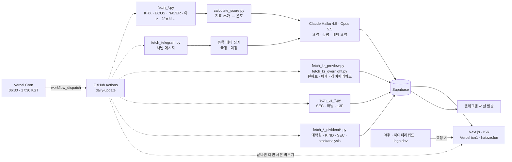

# hatzze | 데이터와 여론으로 읽는 시장

**v1.21.0 베타** · 🔗 **[hatzze.fun](https://hatzze.fun)**

지금 시장이 어떤 상태인지를 여덟 화면과 텔레그램 채널로 보여주는 대시보드입니다.

| 화면 | 보여주는 것 | 원천 |
|---|---|---|
| **시장 브리핑** (`/`) | 지표 25개를 매일 종합한 하나의 온도(℃) | KRX · 한국은행 · 검색어 · 커뮤니티 |
| **국장 미리보기** (`/preview`) | 밤사이 미국이 크게 움직인 날 국내는 보통 얼마에 열렸나 | 핀허브 · 야후 · 하이퍼리퀴드 |
| **데일리 노트** (`/daily`) | 하루의 시장 이야기를 매일 저녁 한 편으로 정리한 글 | 위 화면들의 그날 데이터 |
| **카더라 리포트** (`/kadera` · `/kadera/us`) | 주식 텔레그램에서 국내·미국 종목이 어떻게 회자되는지 | 텔레그램 공개 채널 |
| **테마 리포트** (`/theme` · `/theme/us`) | 국장 26개·미장 16개 테마마다 요즘 도는 얘기, 말 많은 종목, 다가오는 일정, 채널에서 오간 글 | 텔레그램 공개 채널 |
| **배당으로 살기** (`/dividend`) | 배당주를 담고 주수를 적으면 1년에 얼마 받는지 계좌별 세후로, 달마다 얼마 들어오는지 | 예탁결제원(SEIBro) · KIND(배당 결정 공시·고배당기업·배당성향) · 미래에셋 TIGER(과표) · SEC · stockanalysis · 핀허브 |
| **MDD 정밀분석** (`/mdd`) | 종목이 고점에서 얼마나 내려왔고, 과거엔 얼마 만에 돌아왔는지 | 야후 파이낸스 |
| **내부자 리포트** (`/insider`) | 미국 임원과 하원의원, 월가 기관의 신고된 매매 | SEC · 미 하원 · 13F |
| **텔레그램 채널** ([@hatzze69](https://t.me/hatzze69)) | 채널에서 오간 이야기를 관련 종목과 함께 매일 아침·저녁, 주말에 정리 | 텔레그램 공개 채널 |

사이드바는 **오늘 시장**(시장 브리핑·국장 미리보기·데일리 노트) · **시장 여론**(카더라·테마) · **분석과 기록**(배당·MDD·내부자) 세 묶음이고, 아이콘만 남기고 접을 수 있습니다.

종목마다 화면이 따로 있습니다. 국장은 `/stock/종목코드`, 미장은 `/insider/stock/티커`이고 언급 추이 · 움직인 이유 · 다가오는 일정 · 같은 테마 종목이 한 화면에 모입니다. 사이드바 검색칸이나 `⌘K` · `/` 키로 국장 약 2,800종목과 미장 약 200종목, 테마를 찾습니다. 초성과 티커로도 찾습니다.

2026-08-06 베타 오픈 이후로 화면이 계속 붙는 중이라 로고 옆에 베타 배지를 답니다. 가장 최근에 연 화면은 **테마 리포트**(2026-09-23)이고, 같은 날 **서학개미 장부**(`/seohak`)는 내렸습니다. 판마다 바뀐 것은 [업데이트 기록](https://hatzze.fun/changelog)에 적습니다.

> ⚠️ 햇쩨 지수의 구간, 카더라·테마 리포트의 집계, MDD·국장 미리보기의 과거 통계, 내부자 리포트에 실린 신고 내역, 배당으로 살기의 계산과 바스켓은 모두 **과열 정도**·**회자되는 정도**·**지나간 기록**을 나타낸 표현일 뿐, **재미·참고용이며 매수·매도 신호가 아닙니다.**

[이용약관](https://hatzze.fun/terms) · [개인정보처리방침](https://hatzze.fun/privacy) · [업데이트 기록](https://hatzze.fun/changelog)

---

## 어떻게 도는가



**파이프라인이 계산하고, 프론트는 읽기만 합니다.** 수집·점수 계산·LLM 요약은 GitHub Actions가 하루 두 번 돌려 Supabase에 저장합니다. 화면은 미리 그려 둔 사본(ISR)으로 나가고, 파이프라인이 표를 쓰고 나면 그 화면의 사본을 비우고 다시 데웁니다(`scripts/revalidate.sh` → `/api/revalidate`). 비우기가 빠져도 사본은 한 시간(카더라 30분 · 국장 미리보기 10분)이 지나면 스스로 새로 그립니다.

요청 시점에 바깥을 부르는 자리는 셋입니다. 야후 시세(MDD 계산 · 종목 카드 현재가), 국장 미리보기의 '해외에서 거래 중인 값' 카드(하이퍼리퀴드 선물가 · 원/달러 · 국장 종가), 종목 로고(logo.dev)입니다. 미리보기 카드는 **10분 칸을 벽시계에 맞춰** 끊어 받아서(9:10 · 9:20 …) 방문자가 몇이든 상류로는 10분에 한 번만 나갑니다. 로고는 `/api/logo`를 거쳐 CDN에 캐시됩니다.

### 한 실행의 짜임

`daily-update` 한 번은 잡 여섯으로 나뉩니다. 내부자와 배당은 카더라·지표와 나란히 돌고, 화면 사본은 셋이 다 끝난 뒤 한 번 더 통째로 비웁니다.

| 잡 | 하는 일 |
|---|---|
| `guard` | 이 슬롯을 이미 누가 처리했는지 봅니다. 처리했으면 뒤를 전부 건너뛰고, 이 잡이 고장 나면 뒤는 그냥 돕니다 |
| `krx_master` | KRX 상장 종목과 종가를 갱신합니다. `update`와 `dividend`가 이 잡을 기다립니다 |
| `update` | 국장 미리보기 → 카더라 수집·분류·집계(국장·미장) → 총평·테마 요약 → 지표 25개·점수 → 오늘의 요약 → 채널 발송 |
| `insider` | 내부자 리포트(Form 4 · 하원 신고 · 13F · 애널리스트 컨센서스) |
| `dividend` | 배당으로 살기(예탁원 배당 기록 · 배당 결정 공시 · 미국 배당주 · ETF 분배금 · 고배당기업 · 배당성향) |
| `finalize` | 앞의 세 잡이 끝나면 화면 사본을 전부 비우고 데웁니다. 앞 잡이 실패해도 돕니다 |

`update` 안에서는 **카더라가 먼저, 지표가 나중**입니다. 카더라는 KRX와 무관해 아무 때나 돌 수 있고, 지표는 KRX가 전 영업일 자료를 올리는 08:00 KST를 기다려야 합니다.

## 설계에서 지키는 것

- **절대량이 아니라 점유율로 비교합니다.** 주말엔 메시지가 평일의 1/10로 떨어져, 언급 수로 증감을 재면 모든 항목이 일제히 ▼로 나옵니다.
- **유령 언급을 셈에서 뺍니다.** 종목명이 일반 단어나 다른 고유명사에 얹히면 없는 언급이 잡힙니다(하이브 ← 하이브**로**자임). 실행마다 급부상 카드에 오른 종목을 한 번 더 보고, 유령이 의심되면 알림 이슈를 엽니다.
- **LLM이 쓴 문장은 검수 레이어(`common/text_check.py`)를 지나야 저장됩니다.** 화면에는 ✨ 표시가 붙습니다.
- **LLM은 구독으로 먼저 부르고, 막히면 API 키로 다시 부릅니다**(`common/llm_client.py`). 분류·감성은 과열지수 눈금이 Haiku 출력에 맞춰져 있어 Haiku 4.5로 고정하고, 사람이 가장 먼저 읽는 두 자리(카더라 총평 · 채널 글)만 Opus 5.5로 씁니다.
- **조회 실패를 빈 자료로 보이지 않게 합니다.** 카드는 '없습니다' 대신 '불러오지 못했습니다'라고 적고, 실패한 렌더는 사본에 담지 않습니다. 자료 서버가 잠시 멈추면 마지막으로 잘 만든 사본이 그대로 나갑니다(`lib/load-state.ts`).
- **화면 한 벌이 같은 시각 언어를 씁니다.** 색·간격·모서리는 전역 토큰(`app/globals.css` · `app/styles/` · `app/ui.tsx`)에서만 나오고, 검색·다이얼로그·이동 경로는 shadcn/ui 부품을 옮겨 씁니다(`components/ui/`). 라이트·다크와 모바일(≤560px) 구성을 모두 지원합니다.

---

## 지표 (25개)

25개 지표의 과열도를 가중 평균해 `0~100`을 시장 온도 `℃`로 옮깁니다. 구간은 저온(`0–24`) · 상온(`25–49`) · 고온(`50–74`) · 초고온(`75–100`) 넷입니다.

가중치와 눈금은 **코드가 소스 오브 트루스**입니다(`data-pipeline/config/`). 실데이터의 고점·저점 구간에서 지표마다 스프레드를 재서 무게를 배정하고, 눈금을 손댈 때마다 `data-pipeline/backtest/`로 과거 구간을 통째로 다시 돌립니다(최근 재보정 2026-08-01).

<details>
<summary><b>시장 지표 (14개)</b></summary>

- 코스피 신고가 대비 괴리율 · 코스피 상승 속도(60일) · 버핏지수 · 거래대금 급증도
- VKOSPI · 금 대비 코스피 상대강도 · 원/달러 환율 변동성 · 레버리지·선물 약정
- 아시아 3국 대비 코스피 · 최근 한 달 매매 안전장치 동향 · 고점권 외국인 매도
- 옵션 풋/콜 비율 · 급등 종목 비율 · 거래대금 쏠림도

</details>

<details>
<summary><b>감성 지표 (11개)</b></summary>

- 주식 초보 검색량 · 디씨 주갤 감성 · 경제뉴스 감성 · 경제 베스트셀러 비중
- 재테크 유튜브 조회수 · 명품·수입차 소비 검색 · 오마카세·파인다이닝 웨이팅 검색
- 실물–증시 괴리 · 코인 투자 과열 · 깃헙 거래봇 생성 수 · 증권 앱 인기차트 순위

</details>

---

## 기술 스택

| | |
|---|---|
| **프론트엔드** | Next.js 16 (App Router · ISR) · React 19 · TypeScript · Tailwind CSS 4 · shadcn/ui 부품(Base UI · cmdk) |
| **파이프라인** | Python 3.11 · Claude Haiku 4.5 · Claude Opus 5.5 (Claude Code 구독, 안 되면 Anthropic API) · Telethon |
| **데이터베이스** | Supabase (PostgreSQL, RLS) |
| **자동화·배포** | Vercel Cron → GitHub Actions · Vercel (서울 리전 `icn1`) |
| **검사** | PR마다 타입 · lint · 단위 테스트(Node 테스트 러너 · pytest) · 라우트와 사이트맵 대조 |

## 폴더 구조

```
app/              Next.js(App Router) 화면 · api/ · styles/ · ui.tsx·globals.css(전역 토큰)
components/       검색 팔레트 · 이동 경로 · ui/(shadcn/ui에서 옮긴 부품)
lib/              Supabase 조회 · 야후 시세 · MDD 계산 · 검색 순위 · 포맷 유틸
pages/            500.tsx 하나(사본이 없는 첫 렌더가 실패할 때의 오류 화면)
tests/            프론트 단위 테스트
scripts/          화면 사본 비우기(revalidate.sh) · 라우트와 사이트맵 대조
data-pipeline/
  scripts/        fetch_*.py · calculate_*.py · generate_*.py · 텔레그램 수집·분석·발송
  config/         지표 임계값·가중치 · 종목 별칭 · 테마 사전 · 배당 종목군
  backtest/       눈금·가중치 재보정 하네스
  common/         Supabase·야후·KRX·HTTP 클라이언트 · LLM 호출·문장 검수 · 텔레그램 글 조립
  tests/          파이프라인 단위 테스트
supabase/         schema.sql + migration_001~086
githooks/         main 직접 커밋을 막는 pre-commit
.github/workflows/  daily-update · telegram-broadcast · us-dict-scan · indexnow · ci
```

---

## 로컬 개발

```bash
npm install
git config core.hooksPath githooks   # 클론마다 한 번
cp .env.example .env.local           # 키를 채웁니다
npm run dev                          # http://localhost:3000
```

한 워킹트리에서 dev 서버를 둘 이상 띄울 땐 두 번째를 `npm run dev:alt`로 띄웁니다(`.next`를 서로 덮어씁니다). 프리페치와 화면 전환 속도, 화면 사본(ISR)은 프로덕션 빌드에서만 확인되니 `npm run build:local` + `npm run start:local`을 씁니다.

PR을 올리기 전에 CI와 같은 검사를 돌립니다.

```bash
npm run typecheck && npm run lint && npm test && npm run check:routes
```

```bash
cd data-pipeline
python -m venv .venv && source .venv/bin/activate
pip install -r requirements.txt
python scripts/calculate_score.py          # 지표 종합 점수
python scripts/fetch_telegram.py           # 카더라 채널 메시지 수집
python -m pytest tests -q                  # 파이프라인 단위 테스트
```

텔레그램 스크립트는 세션이 먼저 필요합니다. `my.telegram.org`에서 `api_id`/`api_hash`를 발급받고 `python scripts/generate_telegram_session.py`로 한 번 로그인하세요. **세션 문자열은 계정 로그인 권한이라 절대 커밋하면 안 됩니다.**

## 환경변수

| 변수 | 용도 |
|---|---|
| `SUPABASE_URL` / `SUPABASE_PUBLISHABLE_KEY` / `SUPABASE_SECRET_KEY` | 프론트 읽기 · 파이프라인 쓰기 · 카더라 조회 |
| `KRX_API_KEY` · `ECOS_API_KEY` · `KSD_API_KEY` | 거래소 시세 · 한국은행 · 예탁결제원(국내 배당 기록) |
| `NAVER_HUB_KEY_ID` / `NAVER_HUB_KEY` · `YOUTUBE_API_KEY` · `ALADIN_TTB_KEY` | 검색어트렌드·뉴스 · 유튜브 · 베스트셀러 |
| `ANTHROPIC_API_KEY` | 오늘의 요약 · 카더라 총평 · 테마 요약 · 채널 글. 구독 경로가 막히면 이 키로 부릅니다 |
| `CLAUDE_CODE_OAUTH_TOKEN` | 선택. 있으면 LLM 호출을 Claude Code 구독(`claude -p`)으로 먼저 보냅니다 |
| `TELEGRAM_API_ID` / `TELEGRAM_API_HASH` / `TELEGRAM_SESSION` · `TELEGRAM_CHANNELS_SHEET_ID` | 카더라 메시지 수집 · 채널 목록 |
| `TELEGRAM_BOT_TOKEN` / `TELEGRAM_BROADCAST_CHAT_ID` | 채널 발송 (수집용과 별개인 봇) |
| `FINNHUB_API_KEY` | 미국 종목 간밤 등락 (국장 미리보기) · 미국 배당주·ETF 시세 |
| `FRED_API_KEY` · `GITHUB_TOKEN` · `KMA_API_KEY` | 원/달러 예비(ECB가 안 올 때) · 깃헙 검색(없으면 비인증) · 도입 예정 |
| `REVALIDATE_SECRET` | 화면 사본을 비우는 `/api/revalidate`의 비밀. 깃헙 시크릿과 Vercel 환경변수에 같은 값을 둡니다 |
| `CRON_SECRET` · `GH_DISPATCH_TOKEN` | Vercel에만 둡니다. 크론 호출 확인 · 깃헙 `workflow_dispatch` 던지기 |
| `NEXT_PUBLIC_GA_ID` · `LOGO_DEV_KEY`(옛 이름 `NEXT_PUBLIC_LOGO_DEV_KEY`도 읽음) · `*_SITE_VERIFICATION` | 선택. 없으면 그 기능만 빠집니다 |

`NEXT_PUBLIC_` 접두어가 붙은 값은 클라이언트에 그대로 노출되는 공개값입니다.

---

## 자동화

시각은 **Vercel Cron**이 지키고(`vercel.json`), 그게 깃헙 API로 `workflow_dispatch`를 던집니다(`app/api/cron/pipeline`). 일하는 곳은 그대로 깃헙 러너입니다.

| 발사(KST) | 워크플로 | 하는 일 |
|---|---|---|
| 06:30 | `daily-update` | 지표·카더라·테마 갱신, 내부자·배당 표(미국 종가), 평일이면 08:00 무렵 개장 전 요약 |
| 17:30 | `daily-update` | 그날 종가 확보 + 아침 만회, 배당 표(국내 종가·배당 기록), 평일이면 20:00 무렵 저녁 브리핑 |
| 수 12:30 · 토 10:30 · 일 21:00 | `telegram-broadcast` | 주중 점검(수) · 이번 주 미장 흐름(토) · 한 주 정리와 다음 주 일정(일) |
| 월 10:00 | `us-dict-scan` | 미국 종목 사전 후보 스캔 |

지수 종가(야후)는 저녁 실행만 담으므로 저녁 발사를 16:00보다 앞당기지 않습니다.

국장 미리보기의 종목 벽은 **아침 실행에서만** 갱신됩니다(개장 전에 보는 화면이라 저녁 실행이 그 줄을 덮으면 안 됩니다). 견줄 국장 종가는 15:30에 바뀌므로 **저녁 실행도 함께** 갈아 끼웁니다.

**깃헙 예약은 셋 다 껐습니다.** 부하가 높으면 지연되고 심하면 슬롯을 통째로 버리기 때문입니다(공식 문서). 2026-08-26~28에 실행이 3~10시간씩 늦게 생기다가 08-28에는 네 발화 중 둘이 8시간 늦게 오고 둘은 아예 오지 않아, 하루 두 번을 다 손으로 돌렸습니다. `workflow_dispatch`는 배치 스케줄러가 아니라 실시간 경로라 생성과 시작이 같은 초입니다.

되돌릴지 정하려고 제품과 무관한 카나리를 매시 :23에 8일 돌려 봤습니다. 매시라면 190번이어야 할 190시간에 47번만 와서 전달률이 25%였고, 간격은 중앙 233분에 최대 503분이었습니다. 회복 기색이 없어 되돌리지 않기로 하고 카나리도 걷었습니다(2026-09-06).

Vercel이 같은 예약을 두 번 부를 수 있어서, 크론은 던지기 전에 그 슬롯의 실행이 이미 있는지 봅니다. 깃헙이 5xx를 주면 실행 목록을 다시 확인한 뒤 세 번까지 던지고, 확인이 안 되면 던지지 않습니다.

각 스텝은 `continue-on-error`라 개별 실패가 전체를 막지 않고, 실패하면 **제목이 곧 진단**인 알림 이슈가 열립니다. 갱신이 멈췄는데 화면은 옛 값을 태연히 보여주는 **조용한 고장**은 `check_freshness.py`와 `check_telegram_coverage.py`가 잡습니다.

### 텔레그램 채널 발송

[채널](https://t.me/hatzze69)에 다섯 가지 글이 나갑니다. 전부 같은 형식입니다. **이야기 제목 → 문장 두세 개 → 관련 종목과 등락**(인용 박스). 300여 개 채널을 대신 읽어 주는 요약이라는 성격은 그대로입니다.

| | 언제 | 내용 |
|---|---|---|
| 🌅 개장 전 요약 | 월~금 · 08:00 무렵(개장 전) | 밤사이(18~08시) 이야기 3~4개 + 오늘 일정 |
| 🌆 저녁 브리핑 | 월~금 · 저녁 파이프라인 끝 무렵(20:00 무렵) | 온도 + 오늘 이야기 3~4개(어떤 종목이 왜 움직였나) + 처음 회자된 종목 + 내일 일정 |
| 🔄 주중 점검 | 수요일 12:30 | 월~수 이야기의 흐름 4개 + 새로 회자된 종목 + 남은 주 일정 |
| 📈 이번 주 미장 흐름 | 토요일 10:30 | 금요일 세션까지 한 주의 미국장 이야기 4개 + 다음 주 미장 일정 |
| 📅 한 주 정리와 다음 주 일정 | 일요일 21:00 | 온도 흐름 + 한 주 이야기 4개 + 새로 회자된 종목 + 다음 주 일정 |

수·토·일 시각은 사이트 방문 시간대를 재서 정했습니다(2026-08-14~09-10 실측). 수요일은 점심, 토요일은 오전, 일요일은 밤에 사람이 가장 많습니다.

글은 `common/broadcast_digest.py`가 만듭니다. 그 시간대 메시지에서 조회·전달 상위 발췌 70~100편을 고르고(같은 글을 나른 채널은 묶어서 세고), 종목 태그·그날 움직인 종목의 까닭·채널이 짚은 일정을 함께 Claude Opus 5.5에 한 번 넘깁니다(구독이 막힌 날은 Haiku 4.5). 나온 이야기마다 네 가지를 검사합니다. 문장이 끝까지 왔는가 · 금지어 · 오타 · **서로 다른 채널 둘 이상이 다룬 이야기인가**. 종목은 자료에 있던 이름으로만 풀리고, 등락은 KRX 확정값이 있으면 그것, 없으면 야후를 쓰되 글이 말하는 기간(그날 하루 · 주초부터)에 맞춥니다. 언급 수·채널 수 같은 숫자는 고르는 데만 쓰고 글에는 싣지 않습니다.

**개장 전 요약은 파이프라인 중간에서 나갑니다.** 이 글은 09:00 개장 전에 도착해야 뜻이 서는데, 파이프라인 끝에 두면 개장 뒤에 도착하는 날이 있었습니다. 그래서 재료가 준비되는 자리(미국 종목 집계 뒤)로 올렸습니다. 온도를 싣는 저녁 브리핑은 점수 계산 뒤에 그대로 있습니다.

발송은 **자료가 신선할 때만** 나갑니다. 구독자 전원에게 틀린 숫자를 쏘는 건 화면에 틀린 숫자가 떠 있는 것보다 회수가 어렵습니다. 미리보기는 `python scripts/send_telegram_broadcast.py --format <morning2|evening2|midweek|us_weekend|weekly2>`이고, **`--send`를 붙이지 않으면 발송하지 않습니다.** `--as-of YYYY-MM-DD`로 기준일을 못박아 다른 요일의 글을 미리 볼 수 있고, `--notice <파일>`로 손으로 쓴 공지를 같은 봇으로 보냅니다.

---

## 데이터 출처

KRX Open API · 한국거래소 KIND · 한국은행 ECOS · 한국예탁결제원 · 미 연준 FRED · 유럽중앙은행 ECB(환율) · SEC EDGAR · 미 하원 공시 · stockanalysis.com · NAVER API HUB · YouTube Data API · 알라딘 · GitHub Search API · Apple App Store · DCInside · Upbit · Yahoo Finance · Finnhub · Hyperliquid · Telegram(공개 채널)

국내 시장 데이터는 KRX에서 받되, **KRX가 종가를 다음 날 08:00에 올리는 탓에** 지수 종가와 당일 종가는 야후에서 받습니다.
