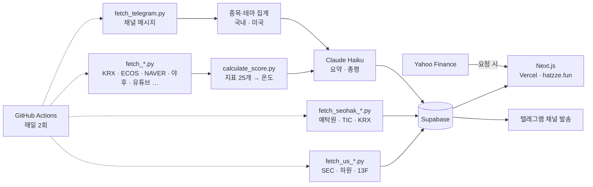

# hatzze | 데이터와 여론으로 읽는 시장

**v1.4.2 베타** · 🔗 **[hatzze.fun](https://hatzze.fun)**

지금 시장이 어떤 상태인지를 다섯 화면으로 보여주는 대시보드입니다.

| 화면 | 보여주는 것 | 원천 |
|---|---|---|
| **시장 브리핑** (`/`) | 지표 25개를 매일 종합한 하나의 온도(℃) | KRX · 한국은행 · 검색어 · 커뮤니티 |
| **카더라 리포트** (`/kadera` · `/kadera/us`) | 주식 텔레그램에서 국내·미국 종목이 어떻게 회자되는지 | 텔레그램 공개 채널 |
| **MDD 정밀분석** (`/mdd`) | 종목이 고점에서 얼마나 내려왔고, 과거엔 얼마 만에 돌아왔는지 | 야후 파이낸스 |
| **내부자 리포트** (`/insider`) | 미국 임원과 하원의원, 월가 기관의 신고된 매매 | SEC · 미 하원 · 13F |
| **서학개미 장부** (`/seohak`) | 개인이 미국 주식을 언제 사고팔고 지금 얼마가 됐는지 | 예탁결제원 · 미 재무부 TIC |

여섯 번째 화면 **국장 미리보기**는 준비 중입니다. 2026-08-06 베타 오픈 이후로 화면이 계속 붙는 중이라 로고 옆에 베타 배지를 답니다.

> ⚠️ 햇쩨 지수의 구간, 카더라의 집계, MDD의 과거 통계, 내부자 리포트에 실린 신고 내역은 모두 **과열 정도**·**회자되는 정도**·**지나간 기록**을 나타낸 표현일 뿐, **재미·참고용이며 매수·매도 신호가 아닙니다.**

[이용약관](https://hatzze.fun/terms) · [개인정보처리방침](https://hatzze.fun/privacy) · [변경 기록](https://hatzze.fun/changelog)

---

## 어떻게 도는가



**파이프라인이 계산하고, 프론트는 읽기만 합니다.** 수집·점수 계산·LLM 요약은 GitHub Actions가 하루 두 번 돌려 Supabase에 저장하고, Next.js는 요청마다 최신 값을 읽어 렌더합니다. 요청 시점에 바깥을 부르는 자리는 야후 시세 둘뿐입니다(MDD 계산 · 종목 카드 현재가).

한 실행 안에서는 **카더라가 먼저, 지표가 나중**입니다. 카더라는 KRX와 무관해 아무 때나 돌 수 있고, 지표는 KRX가 전 영업일 자료를 올리는 08:00 KST를 기다려야 합니다.

## 설계에서 지키는 것

- **절대량이 아니라 점유율로 비교합니다.** 주말엔 메시지가 평일의 1/10로 떨어져, 언급 수로 증감을 재면 모든 항목이 일제히 ▼로 나옵니다.
- **유령 언급을 셈에서 뺍니다.** 종목명이 일반 단어나 다른 고유명사에 얹히면 없는 언급이 잡힙니다(하이브 ← 하이브**로**자임).
- **LLM이 쓴 문장은 검수 레이어(`common/text_check.py`)를 지나야 저장됩니다.** 화면에는 ✨ 표시가 붙습니다.
- **화면 한 벌이 같은 시각 언어를 씁니다.** 색·간격·모서리는 전역 토큰(`app/globals.css`·`app/ui.tsx`)에서만 나오고, 라이트·다크와 모바일(≤560px) 구성을 모두 지원합니다.

---

## 지표 (25개)

25개 지표의 과열도를 가중 평균해 `0~100`을 시장 온도 `℃`로 옮깁니다. 구간은 저온(`0–24`) · 상온(`25–49`) · 고온(`50–74`) · 초고온(`75–100`) 넷입니다.

가중치와 눈금은 **코드가 소스 오브 트루스**입니다(`data-pipeline/config/`). 실데이터의 고점·저점 구간에서 지표마다 스프레드를 재서 무게를 배정하고, 눈금을 손댈 때마다 `data-pipeline/backtest/`로 과거 구간을 통째로 다시 돌립니다(최근 재보정 2026-08-01).

<details>
<summary><b>시장 지표 (14개)</b></summary>

- 코스피 신고가 대비 괴리율 · 코스피 상승 속도(60일) · 버핏지수 · 거래대금 급증도
- VKOSPI · 금 대비 코스피 상대강도 · 원/달러 환율 변동성 · 레버리지·선물 약정
- 아시아 3국 대비 코스피 · 최근 한 달 매매 안전장치 동향 · 고점권 외국인 매도
- 옵션 풋/콜 비율 · 급등 종목 비율 · 거래대금 쏠림도

</details>

<details>
<summary><b>감성 지표 (11개)</b></summary>

- 주식 초보 검색량 · 디씨 주갤 감성 · 경제뉴스 감성 · 경제 베스트셀러 비중
- 재테크 유튜브 조회수 · 명품·수입차 소비 검색 · 오마카세·파인다이닝 웨이팅 검색
- 실물–증시 괴리 · 코인 투자 과열 · 깃헙 거래봇 생성 수 · 증권 앱 인기차트 순위

</details>

---

## 기술 스택

| | |
|---|---|
| **프론트엔드** | Next.js 16 (App Router) · React 19 · TypeScript · Tailwind CSS 4 |
| **파이프라인** | Python 3.11 · Anthropic SDK (Claude Haiku) · Telethon |
| **데이터베이스** | Supabase (PostgreSQL, RLS) |
| **자동화·배포** | GitHub Actions · Vercel (서울 리전 `icn1`) |

## 폴더 구조

```
app/              Next.js(App Router) 화면 · api/ · ui.tsx·globals.css(전역 토큰)
lib/              Supabase 조회 · 야후 시세 · MDD 계산 · 포맷 유틸
data-pipeline/
  scripts/        fetch_*.py · calculate_*.py · generate_*.py · 텔레그램 수집·분석·발송
  config/         지표 임계값·가중치 · 종목 별칭 · 테마 사전
  backtest/       눈금·가중치 재보정 하네스
  common/         Supabase·야후·KRX·HTTP 클라이언트 · LLM 문장 검수
supabase/         schema.sql + migration_001~054
.github/workflows/  daily-update.yml · telegram-broadcast.yml · us-dict-scan.yml
```

---

## 로컬 개발

```bash
npm install
git config core.hooksPath githooks   # 클론마다 한 번
cp .env.example .env.local           # 키를 채웁니다
npm run dev                          # http://localhost:3000
```

한 워킹트리에서 dev 서버를 둘 이상 띄울 땐 두 번째를 `npm run dev:alt`로 띄웁니다(`.next`를 서로 덮어씁니다). 프리페치와 화면 전환 속도는 프로덕션 빌드에서만 확인되니 `npm run build:local` + `npm run start:local`을 씁니다.

```bash
cd data-pipeline
python -m venv .venv && source .venv/bin/activate
pip install -r requirements.txt
python scripts/calculate_score.py          # 지표 종합 점수
python scripts/fetch_telegram.py           # 카더라 채널 메시지 수집
```

텔레그램 스크립트는 세션이 먼저 필요합니다. `my.telegram.org`에서 `api_id`/`api_hash`를 발급받고 `python scripts/generate_telegram_session.py`로 한 번 로그인하세요. **세션 문자열은 계정 로그인 권한이라 절대 커밋하면 안 됩니다.**

## 환경변수

| 변수 | 용도 |
|---|---|
| `SUPABASE_URL` / `SUPABASE_PUBLISHABLE_KEY` / `SUPABASE_SECRET_KEY` | 프론트 읽기 · 파이프라인 쓰기 · 카더라 조회 |
| `KRX_API_KEY` · `ECOS_API_KEY` · `KSD_API_KEY` | 거래소 시세 · 한국은행 · 예탁결제원 |
| `NAVER_HUB_KEY_ID` / `NAVER_HUB_KEY` · `YOUTUBE_API_KEY` · `ALADIN_TTB_KEY` | 검색어트렌드·뉴스 · 유튜브 · 베스트셀러 |
| `ANTHROPIC_API_KEY` | 오늘의 요약 · 카더라 총평 (Claude Haiku) |
| `TELEGRAM_API_ID` / `TELEGRAM_API_HASH` / `TELEGRAM_SESSION` · `TELEGRAM_CHANNELS_SHEET_ID` | 카더라 메시지 수집 · 채널 목록 |
| `TELEGRAM_BOT_TOKEN` / `TELEGRAM_BROADCAST_CHAT_ID` | 채널 발송 (수집용과 별개인 봇) |
| `FRED_API_KEY` · `KMA_API_KEY` · `GITHUB_TOKEN` | 도입 예정 둘 · 깃헙 검색(없으면 비인증) |
| `NEXT_PUBLIC_GA_ID` · `NEXT_PUBLIC_LOGO_DEV_KEY` · `*_SITE_VERIFICATION` | 선택. 없으면 그 기능만 빠집니다 |

`NEXT_PUBLIC_` 접두어가 붙은 값은 클라이언트에 그대로 노출되는 공개값입니다.

---

## 자동화

`daily-update.yml`이 매일 두 번 파이프라인을 돌립니다. 시각을 지키는 건 **Vercel Cron**이고(`vercel.json`), 그게 깃헙 API로 `workflow_dispatch`를 던집니다.

| 발사 | 실제 실행 | 완료 | 화면 표기 | 역할 |
|---|---|---|---|---|
| 07:00 KST | 07:00 (즉시) | ~08:27 | 오전 9시 | 주 실행 |
| 18:00 KST | 18:00 (즉시) | ~19:23 | 오후 8시 | 아침 실패 만회 + 그날 종가 |

**시계를 깃헙 밖으로 옮긴 이유.** 깃헙 예약은 부하가 높으면 지연되고 심하면 슬롯을 통째로 버립니다(공식 문서). 2026-08-26~28에 실행이 3~10시간씩 늦게 생기다가 네 발화가 모두 실행을 만들지 못했습니다. `workflow_dispatch`는 배치 스케줄러가 아니라 실시간 경로라 생성과 시작이 같은 초입니다.

깃헙 예약은 **백업**으로 남아 있습니다(07:30·18:30 KST). Vercel이 던진 날에는 `guard` 잡이 "이 슬롯을 이미 처리했다"며 10초 만에 빠지고, Vercel이 못 던진 날에만 실제로 돕니다. 지표는 여전히 잡 안의 대기 게이트로 08:00 KST 공표를 못 박습니다.

각 스텝은 `continue-on-error`라 개별 실패가 전체를 막지 않고, 실패하면 **제목이 곧 진단**인 알림 이슈가 열립니다. 갱신이 멈췄는데 화면은 옛 값을 태연히 보여주는 **조용한 고장**은 `check_freshness.py`와 `check_telegram_coverage.py`가 잡습니다.

### 텔레그램 채널 발송

[채널](https://t.me/hatzze69)에 네 가지 글이 나갑니다.

| | 언제 | 내용 |
|---|---|---|
| A 어제 브리핑 | 월~금 · 오전 파이프라인 후 | 어제 이슈 키워드 + 밤사이 오간 이야기 |
| B 마감 리포트 | 월~금 · 오후 파이프라인 후 | 오늘의 온도 + 급부상 종목 3 |
| C 관심 이동 | 수·토 오후 2시 | 테마 순위 변동 |
| D 주간 결산 | 일요일 오후 2시 | 주간 최다 언급 종목·테마 |

발송은 **자료가 신선할 때만** 나갑니다. 구독자 전원에게 틀린 숫자를 쏘는 건 화면에 틀린 숫자가 떠 있는 것보다 회수가 어렵습니다. 미리보기는 `python scripts/send_telegram_broadcast.py --format <이름>`이고, **아무 인자 없이 돌리면 발송하지 않습니다.**

---

## 데이터 출처

KRX Open API · 한국은행 ECOS · 한국예탁결제원 · 미 재무부 TIC · SEC EDGAR · 미 하원 공시 · NAVER API HUB · YouTube Data API · 알라딘 · GitHub Search API · Apple App Store · DCInside · Upbit · Yahoo Finance · Telegram(공개 채널)

지수 종가는 야후, 나머지 국내 시장 데이터는 KRX에서 받습니다.
